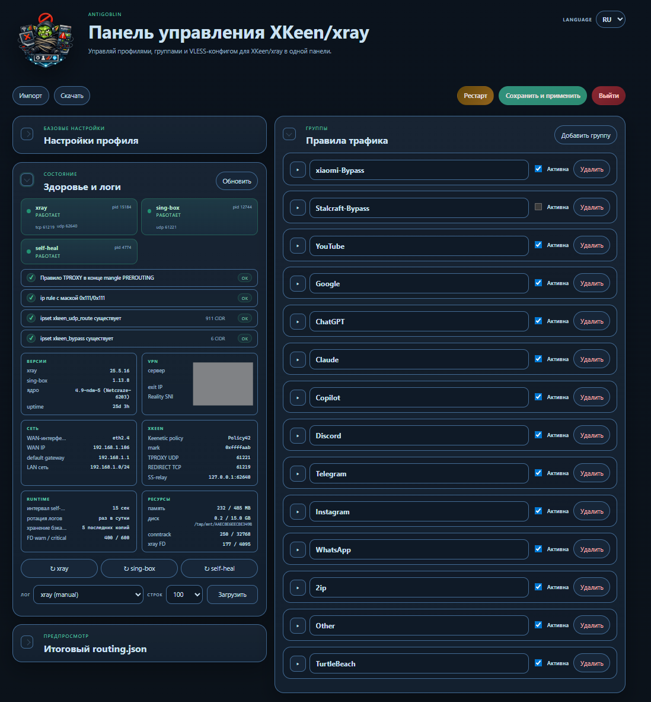

# AntiGoblin

<p align="center">
  
</p>

`AntiGoblin` — это панель управления для `Keenetic + Entware + XKeen/xray + sing-box`, которая живет на самом роутере.

После установки рабочий сценарий пользователя:

1. Открыть UI на `http://<router-ip>:8899/`.
2. Заполнить `VLESS Reality`.
3. Создать routing-группы.
4. Нажать `Сохранить и применить`.
5. В Keenetic web UI назначить нужные устройства в политику `xkeen` в разделе «Приоритеты подключений».

После этого роутер использует:

- политику Keenetic `xkeen` для выбора устройств;
- `iptables` для перехвата `TCP` и `UDP` устройств из `xkeen`;
- `xray` для маршрутизации `TCP` в `vless-reality` или `direct`;
- `sing-box` для маршрутизации `UDP` в VLESS Reality (через локальный SS-relay в `xray`).

Текущая живая модель runtime:

- любая UI-группа с outbound `vless-reality` гонит и `TCP`, и `UDP` через VPN — отдельных флагов для UDP нет;
- группы с outbound `bypass` обходят `xray` полностью через `RETURN`;
- группы с outbound `direct` входят в `xray`, но уходят напрямую без VPN;
- общий `UDP` устройств вне VPN-групп идет напрямую;
- локалка и discovery обходят `xray` через `RETURN`.

## Оглавление

- [Подготовка Keenetic (один раз руками)](#подготовка-keenetic-один-раз-руками)
  - [Совместимые модели](#совместимые-модели)
  - [Шаг 1. Установить компоненты KeeneticOS](#шаг-1-установить-компоненты-keeneticos)
  - [Шаг 2. Подготовить флешку с Entware на PC](#шаг-2-подготовить-флешку-с-entware-на-pc)
  - [Шаг 3. Подключить Entware к OPKG-менеджеру и перезагрузить](#шаг-3-подключить-entware-к-opkg-менеджеру-и-перезагрузить)
- [Установка одной командой](#установка-одной-командой)
- [Что делать после установки](#что-делать-после-установки)
- [Где брать списки IP / CIDR / доменов для популярных сервисов](#где-брать-списки-ip--cidr--доменов-для-популярных-сервисов)
- [Структура проекта](#структура-проекта)
- [Источник истины](#источник-истины)
- [Runtime-файлы на роутере](#runtime-файлы-на-роутере)
- [Обновление](#обновление)
- [Удаление](#удаление)
- [Разработка](#разработка)
- [Инварианты проекта](#инварианты-проекта)
- [Правила проекта](#правила-проекта)
- [Что под капотом и кому спасибо](#что-под-капотом-и-кому-спасибо)
- [Лицензия и пользовательское соглашение](#лицензия-и-пользовательское-соглашение)

## Подготовка Keenetic (один раз руками)

### Совместимые модели

Подходит любой Keenetic c USB-портом и поддержкой Entware. Live-инсталляция, на которой проект разрабатывался и проверялся — **Netcraze Giga** (ARM-сборка KeeneticOS). На других ARM-роутерах Keenetic должно работать без изменений. MIPS-модели (Lite/4G/Air) формально совместимы, но `xray + sing-box` под MIPS ставить тяжелее и performance скромнее.

Минимальные требования:

- USB-порт (USB 2.0 хватает, USB 3.0 быстрее)
- KeeneticOS 3.5+ (показывается в web UI в разделе «Системный монитор»)
- USB-флешка 4 ГБ+ (Entware занимает ~150 МБ, остальное под логи и кэш opkg)

Архитектуру процессора можно проверить уже после первого SSH через `uname -m`: `aarch64` / `armv7l` / `mipsel` / `mips`.

### Шаг 1. Установить компоненты KeeneticOS

В web UI Keenetic зайти в `Управление → Общие настройки → Изменить набор компонентов` и добавить (всё это обязательно):

- **«Поддержка открытых пакетов»** (раздел «Пакеты OPKG») — открывает менеджер OPKG в web UI.
- **«Файловая система Ext4»** (раздел «Файловые системы») — Entware ставится только на ext-разделы.
- **«Модули ядра подсистемы Netfilter»** (раздел «Сетевые функции») — нужно для `iptables`.
- **«Пакет расширения Xtables-addons для Netfilter»** — нужно для `TPROXY`, `xt_set`, `connmark`.
- **«Доступ через SSH»** (раздел «Сетевые функции») — без него `install.sh` запустить негде.

Желательно дополнительно:

- **«Модули ядра подсистемы Traffic Control»** — некоторые netfilter-модули тянут её зависимостью.

Применить, дождаться перепрошивки и автоматического reboot.

### Шаг 2. Подготовить флешку с Entware на PC

Флешку готовим целиком на компьютере: форматируем в EXT4, кладём правильный installer-tarball, и только потом втыкаем в роутер. Web UI Keenetic сам Entware из интернета не качает — он распакует уже подготовленный installer на первом reboot.

**1. Узнать архитектуру роутера.**

Архитектуру можно посмотреть в web UI Keenetic в `Системный монитор → Системная информация` (показывает процессор) или ориентироваться по модели:

| Модель / процессор | Папка на bin.entware.net | Имя installer-tarball |
|--------------------|--------------------------|------------------------|
| Netcraze Giga, KN ARM64 (Hopper, Peak, Skipper, Hero, Speedster, Ultra KN-1811) | `aarch64-k3.10` | `aarch64-installer.tar.gz` |
| Старшие ARMv7 | `armv7sf-k3.2` | `armv7sf-installer.tar.gz` |
| Lite / 4G / Air (LE-MIPS) | `mipsel-k3.4` | `mipsel-installer.tar.gz` |
| Старые BE-MIPS | `mips-k3.4` | `mips-installer.tar.gz` |

**2. Скачать installer-tarball на PC.**

Собрать URL вида `https://bin.entware.net/<папка>/installer/<имя>.tar.gz`. Для Netcraze Giga это `https://bin.entware.net/aarch64-k3.10/installer/aarch64-installer.tar.gz`. Сохранить файл к себе на PC.

**3. Отформатировать флешку в EXT4.**

Windows нативно ext-разделы не создаёт, нужен сторонний инструмент:

- **MiniTool Partition Wizard Free** — самый дружелюбный к новичкам (выбрать диск → Format → File system: Ext4 → Apply).
- **DiskGenius Free** — аналог.
- **WSL** или Linux: `sudo mkfs.ext4 /dev/sdX1`.

Файловая система — `EXT4`, метку (label) задать осмысленную, например `OPT`.

**4. Скопировать installer на флешку.**

В корне отформатированной флешки создать каталог `install/` и положить туда скачанный `<arch>-installer.tar.gz` **как есть**, без распаковки. Структура должна быть такая:

```text
<USB root>/
└── install/
    └── aarch64-installer.tar.gz   (пример для Netcraze Giga)
```

> **Почему именно `install/`.** Это Keenetic-специфика. Когда ты в web UI сохраняешь настройки `Менеджера пакетов OPKG`, демон `npkg` внутри KeeneticOS монтирует флешку и ищет в корне раздела папку `install/` с архивом `<arch>-installer.tar.gz`. Если находит — сам распаковывает его в `/opt` и поднимает окружение Entware. В системном логе при этом видно строку вида `npkg: inflating aarch64-installer.tar.gz`. Если положить tarball в любую другую папку или сразу распаковать — `npkg` его не подхватит.

Безопасно извлечь флешку из PC и воткнуть в USB-порт роутера.

### Шаг 3. Подключить Entware к OPKG-менеджеру и перезагрузить

В web UI: `Приложения → Менеджер пакетов OPKG`.

1. В поле **«Накопитель»** выбрать только что вставленную флешку (она показывается с EXT4-меткой и UUID).
2. Поле **«Сценарий initrc»** оставить как есть: `/opt/etc/init.d/rc.unslung`.
3. В таблице **«Пользователь»** дать галку доступа `admin` (и/или отдельно созданному `root`).
4. Сохранить и перезагрузить роутер.

На первом reboot Keenetic автоматически распакует tarball из `install/` в файловую систему `/opt` на флешке и подготовит окружение Entware.

После reboot подключиться по SSH и проверить:

```sh
ssh admin@192.168.1.1
/opt/bin/opkg --version
```

Если `opkg` отвечает версией — подготовка закончена, можно ставить AntiGoblin.

> На некоторых прошивках Keenetic (с включённым SSH-компонентом) порт SSH — `222`, а пользователь по умолчанию — `root` с паролем `keenetic`. Если `ssh admin@192.168.1.1` не пускает, попробуй `ssh root@192.168.1.1 -p 222`.

## Установка одной командой

SSH на роутер и выполнить:

```sh
wget -O - https://raw.githubusercontent.com/MaksimSamarin/AntiGoblin/main/install.sh | sh
```

или, если хочется сначала посмотреть скрипт:

```sh
wget -O install.sh https://raw.githubusercontent.com/MaksimSamarin/AntiGoblin/main/install.sh
sh install.sh
```

Скрипт:

- проверяет `Entware/OPKG` в `/opt`;
- ставит пакеты Entware (`xray`, `uhttpd_kn`, `jq`, `iptables`, `ipset`, `conntrack`, `ca-bundle`, `wget`, `tar`, `gzip` и др.);
- скачивает `sing-box` musl-бинарь под архитектуру роутера и кладет в `/opt/sbin/sing-box`;
- скачивает свежий tarball репозитория с GitHub и распаковывает во временный каталог;
- создает UI-видимую политику Keenetic `xkeen` как `Policy42+`, если ее еще нет;
- раскладывает sample-конфиги `xray` и `sing-box` (существующие конфиги не трогаются — для перезаписи использовать `ANTIGOBLIN_FORCE=1`);
- кладет UI и backend в `/opt/share/xkeen-manager/`;
- ставит init-скрипты `S20antigoblin-sysctl`, `S24antigoblin-singbox`, `S25antigoblin-selfheal`, `S26antigoblin`;
- ставит cron и `ndm/fs.d`/`ndm/usb.d` хуки для авто-восстановления после reboot и USB-событий;
- запускает первый цикл `xkeen-selfheal.sh --force` и поднимает UI на `:8899`.

Скрипт идемпотентный: повторный запуск обновит исходники без затирания пользовательской конфигурации. Чтобы пересеять и sample-конфиги:

```sh
ANTIGOBLIN_FORCE=1 sh install.sh
```

После установки скрипт сам напишет URL для UI. Логин и пароль — от web UI Keenetic.

## Что делать после установки

В UI:

- заполнить `VLESS Reality` (адрес сервера, порт, UUID, public key, short ID, SNI);
- создать или включить routing-группы. У каждой группы выбрать outbound:
  - `vless-reality` — TCP и UDP этой группы идут через VPN;
  - `direct` — трафик группы входит в `xray` и выходит без VPN;
  - `bypass` — трафик группы обходит `xray` полностью (через `RETURN`).
- нажать `Сохранить и применить`.

В web UI Keenetic в разделе «Приоритеты подключений» — назначить нужные устройства в политику `xkeen`. Только устройства из этой политики попадают под управление AntiGoblin; остальные политики (например, личная `no_vpn`) не трогаются.

## Где брать списки IP / CIDR / доменов для популярных сервисов

Для routing-групп удобно набивать не только домены, но и CIDR-диапазоны — особенно для сервисов с UDP/RTC (Discord voice, FaceTime, Zoom), у которых пакеты часто идут на голые IP без TLS-SNI. Полезные источники:

- **[iplist.opencck.org](https://iplist.opencck.org/)** — open-source агрегатор. По одному эндпоинту отдает актуальные списки IP/CIDR/доменов для Discord, Telegram, ChatGPT, Cloudflare, Twitter, Meta, Google, YouTube, Apple, Spotify и других популярных сервисов. Формат: текст, JSON, CIDR. Удобно копировать прямо в UI-группу. Сам сервис — open-source проект [rekryt/iplist](https://github.com/rekryt/iplist) под MIT-лицензией; если он вам помог, поставьте звезду и автору.
- **[bgp.he.net](https://bgp.he.net/)** — поиск по AS-номеру или организации, выдает все BGP-префиксы. Полезно, когда нужно найти все CIDR конкретного провайдера/CDN (например, Cloudflare AS13335, Discord AS49544).
- **[ipinfo.io](https://ipinfo.io/)** — лукап одного IP. Покажет ASN, организацию, страну.
- **Официальные списки CDN:**
  - Cloudflare: https://www.cloudflare.com/ips/
  - Apple iCloud Private Relay: https://mask-api.icloud.com/egress-ip-ranges.csv
  - GitHub: https://api.github.com/meta
- **[dnscheck.tools](https://dnscheck.tools/)** — посмотреть, на какие IP резолвится домен у разных DNS-резолверов. Помогает при отладке «работает у меня, не работает на роутере».

Практическое правило: если сервис только TCP (сайт, API) — обычно хватает домена. Если есть UDP/QUIC/RTC/voice — добавляй и CIDR из `iplist.opencck.org`, иначе routing-rule по домену не успеет сработать (у пакета нет SNI).

## Структура проекта

- [docs/architecture.md](docs/architecture.md) — текущая архитектура на Keenetic, Entware, xray и sing-box.
- [docs/project-map.md](docs/project-map.md) — где лежит код, скрипты, конфиги и документация.
- [docs/troubleshooting.md](docs/troubleshooting.md) — типовые проблемы и как их решить.
- [docs/xkeen-manager-ui.md](docs/xkeen-manager-ui.md) — как пользоваться UI и как выкатывать проект.

## Источник истины

Единственный источник истины для UI:

- `/opt/share/xkeen-manager/xkeen-ui-state.json`

Из него backend генерирует:

- `/opt/etc/xray/configs/04_outbounds.json`
- `/opt/etc/xray/configs/05_routing.json`

## Runtime-файлы на роутере

UI и backend:

- `/opt/share/xkeen-manager/index.html`, `app.js`, `styles.css`
- `/opt/share/xkeen-manager/api/routing.cgi`
- `/opt/share/xkeen-manager/api/xkeen-selfheal.sh`
- `/opt/share/xkeen-manager/api/xkeen-runtime.sh`

Bypass собирается только из UI-групп с типом трафика `Bypass`. Их домены и CIDR попадают в runtime `xkeen_bypass` и обходят `xray` через `RETURN`.

UDP-маршрутизация привязана к outbound группы автоматически: для любой включенной группы с outbound `vless-reality` ее домены/CIDR попадают в `xkeen_udp_route`, и совпавший UDP уходит через `TPROXY → sing-box (61221) → xray SS-relay (127.0.0.1:62640) → xray VLESS Reality`. Группы с outbound `direct` или `bypass` UDP не трогают.

Общая сборка runtime живет в `xkeen-runtime.sh`: и apply из UI, и self-heal используют один и тот же код для `iptables`/`ipset`.

## Обновление

Повторный прогон установщика подтянет последнюю версию из main:

```sh
wget -O - https://raw.githubusercontent.com/MaksimSamarin/AntiGoblin/main/install.sh | sh
```

UI state и существующие `xray`/`sing-box` конфиги не пересеваются. Чтобы откатить sample-конфиги к версии из репозитория, добавь `ANTIGOBLIN_FORCE=1`.

## Удаление

```sh
/opt/etc/init.d/S26antigoblin stop
/opt/etc/init.d/S25antigoblin-selfheal stop
/opt/etc/init.d/S24antigoblin-singbox stop
rm -f /opt/etc/init.d/S20antigoblin-sysctl /opt/etc/init.d/S24antigoblin-singbox \
      /opt/etc/init.d/S25antigoblin-selfheal /opt/etc/init.d/S26antigoblin
rm -f /opt/etc/cron.1min/50-antigoblin-selfheal
rm -f /opt/etc/ndm/fs.d/50-antigoblin.sh /opt/etc/ndm/usb.d/50-antigoblin.sh
rm -rf /opt/share/xkeen-manager
```

Политика Keenetic `xkeen`, конфиги в `/opt/etc/xray/configs/` и `/opt/etc/sing-box/` не удаляются автоматически.

## Разработка

Если хочется хакать локально и пушить изменения на роутер прямо с Windows:

```text
.env (gitignored)
ROUTER_HOST=192.168.1.1
ROUTER_SSH_USER=root
ROUTER_SSH_PASSWORD=ssh-пароль-роутера
ROUTER_SSH_PORT=22
ANTIGOBLIN_UI_PORT=8899
```

```powershell
.\scripts\xkeen\deploy_xkeen_manager_stack_to_router.ps1
```

Эти PowerShell-скрипты используют `paramiko` (Python) для SSH/SCP и не нужны конечному пользователю — он ставит всё одной командой `install.sh` через SSH на роутер. Подробнее: [docs/xkeen-manager-ui.md](docs/xkeen-manager-ui.md).

## Инварианты проекта

- `AntiGoblin` имеет право трогать только устройства из политики `xkeen`.
- Любые другие политики Keenetic (например, `no_vpn`) не должны попадать в `xray`.
- `xkeen` создается как дополнительная политика `Policy42+`, чтобы она была видна в Keenetic UI.
- UI-группы AntiGoblin не являются политиками Keenetic и не меняют назначение устройств.

## Правила проекта

- Проект должен оставаться generic для любого совместимого Keenetic.
- В репозиторий нельзя класть live-снапшоты роутера, секреты и личные черновики.
- После каждого подтвержденного бага и решения нужно обновлять [docs/troubleshooting.md](docs/troubleshooting.md).
- После изменения архитектуры нужно обновлять:
  - [README.md](README.md)
  - [docs/architecture.md](docs/architecture.md)
  - [docs/project-map.md](docs/project-map.md)

## Что под капотом и кому спасибо

`AntiGoblin` — это управляющий слой и UI поверх готовых open-source инструментов. Сам проект ничего из этих компонентов не редистрибутирует: пользователь скачивает их сам через `opkg` и `wget` с upstream-источников. Юридических обязательств у нас по их лицензиям нет, но все они достойны того, чтобы быть упомянутыми — без них этого проекта не существовало бы.

| Компонент | Роль в `AntiGoblin` | Лицензия |
|-----------|----------------------|----------|
| [XTLS/Xray-core](https://github.com/XTLS/Xray-core) | TCP transparent proxy на `:61219`, VLESS Reality outbound к VPN-серверу, локальный Shadowsocks-relay для UDP. | MPL-2.0 |
| [SagerNet/sing-box](https://github.com/SagerNet/sing-box) | TPROXY UDP inbound на `:61221` для voice/RTC-трафика, проксирует UDP в локальный xray relay. | GPL-3.0 |
| [Entware](https://github.com/Entware/Entware) | Linux-окружение `/opt` на роутере: `opkg`, базовые утилиты, init-инфраструктура. | GPL-2.0 |
| [uhttpd_kn](https://github.com/Entware/Entware/tree/master/sources/uhttpd_kn) | HTTP-сервер, на котором живёт UI на порту `:8899`. | ISC |
| [iptables](https://www.netfilter.org/projects/iptables/) + [ipset](https://ipset.netfilter.org/) | Mark-based selective routing для устройств политики `xkeen`. | GPL-2.0 |
| [conntrack-tools](https://conntrack-tools.netfilter.org/) | Точечный сброс conntrack-записей при controlled-restart `xray` (предотвращает orphan-сокеты). | GPL-2.0 |
| [jq](https://jqlang.github.io/jq/), [gawk](https://www.gnu.org/software/gawk/), `coreutils-base64`, `net-tools-netstat` | Парсинг state.json, парсинг `ndmc`, JSON-API в backend, вспомогательные утилиты. | разные FOSS-лицензии |
| [KeeneticOS](https://help.keenetic.com/) | Базовый сетевой стек, политики маршрутизации, UI-видимая политика `xkeen`. | проприетарная (предоставляется производителем) |
| [rekryt/iplist](https://github.com/rekryt/iplist) (`iplist.opencck.org`) | Не часть стека, но рекомендуется в README как источник готовых IP/CIDR-листов для популярных сервисов. | MIT |

## Лицензия и пользовательское соглашение

Проект распространяется под лицензией [MIT](LICENSE). По ней:

- Использовать, копировать, модифицировать, встраивать в личные и коммерческие продукты — можно свободно.
- При любом использовании (и в личном проекте, и в коммерческом) нужно сохранять текст лицензии и копирайт автора. Это и есть та самая «подпись» — она уже зашита в файл [LICENSE](LICENSE), и его достаточно положить рядом с проектом или упомянуть автора в about/credits.
- Никаких гарантий нет: проект делает то, что делает. Ответственность за работу VPN-стека на конкретном роутере несет тот, кто его поставил.

Если проект пригодился — поставь, пожалуйста, ⭐ репозиторию [MaksimSamarin/AntiGoblin](https://github.com/MaksimSamarin/AntiGoblin). Это единственная просьба сверх лицензии: помогает понять, что проект кому-то нужен, и мотивирует развивать его дальше.

Если используешь в коммерческой услуге (продаёшь как часть провайдер-сервиса, ставишь клиентам за деньги, и т.п.) — кратко упомяни origin: «based on AntiGoblin by MaksimSamarin» в любом подходящем месте (about, документация, чек, договор — на твой выбор).
