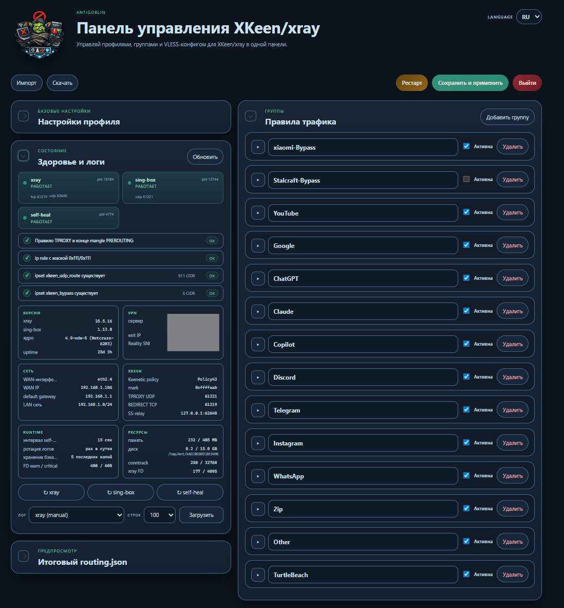

# AntiGoblin

<p align="center">
  
</p>

`AntiGoblin` — это панель управления для `Keenetic + Entware + XKeen/xray + sing-box`, которая живёт на самом роутере.

После установки рабочий сценарий пользователя:

1. Открыть UI на `http://<router-ip>:8899/`.
2. Добавить **ключ** — вручную через `vless://` / `vmess://` / `hysteria2://` URI, или подключить **подписку** по HTTPS-URL.
3. Выбрать активный ключ (radio-кнопка в блоке «Активный ключ»).
4. Создать routing-группы.
5. Нажать `Сохранить и применить`.
6. В Keenetic web UI назначить нужные устройства в политику `xkeen` в разделе «Приоритеты подключений».

После этого роутер использует:

- политику Keenetic `xkeen` для выбора устройств;
- `iptables` для перехвата `TCP` и `UDP` устройств из `xkeen`;
- `xray` для маршрутизации `TCP` через активный ключ или `direct`;
- `sing-box` для маршрутизации `UDP`: либо через xray SS-relay (для xray-протоколов), либо напрямую через свой outbound (для `hysteria2`).

Текущая живая модель runtime:

- любая UI-группа с outbound `vless-reality` гонит и `TCP`, и `UDP` через VPN — отдельных флагов для UDP нет;
- группы с outbound `bypass` обходят `xray` полностью через `RETURN`;
- группы с outbound `direct` входят в `xray`, но уходят напрямую без VPN;
- общий `UDP` устройств вне VPN-групп идёт напрямую;
- локалка и discovery обходят `xray` через `RETURN`;
- дополнительно на LAN-IP роутера поднят **SOCKS5-inbound (порт 61080, TCP+UDP)** — для точечного per-process туннеля с PC ([подробнее](#точечный-туннель-для-приложений-с-pc-socks5-inbound)).

## Поддерживаемые протоколы и транспорты

В одном профиле можно держать **несколько ключей** (manual или из подписки) и переключаться между ними одной кнопкой. Все парсятся универсально:

| Протокол | Транспорты | Безопасность | Тоннелирует через |
|----------|-----------|--------------|-------------------|
| **VLESS** | `tcp`, `ws`, `grpc`, `xhttp` | `reality`, `tls`, `none` | xray |
| **VMess** | `tcp`, `ws`, `grpc` | `tls`, `reality`, `none` | xray |
| **Hysteria2** (`hy2://` тоже) | `quic` (UDP) | `tls`, obfs (Salamander), pinSHA256 | sing-box, xray ходит SOCKS5'ом в sing-box на `127.0.0.1:61225` |

Особенности:

- **XHTTP** разбирает все `mode`-варианты (`auto`/`packet-up`/`stream-up`/`stream-one`) и весь `extra={...}` блок (`scMaxEachPostBytes`, `scMaxConcurrentPosts`, `scMinPostsIntervalMs`, `xPaddingBytes`, `noGRPCHeader` и т. п.). Это критично — без правильно прокинутого `extra` стрим-up handshake не складывается и сервер скатывается в Reality fallback HTML.
- **gRPC** покрывает `serviceName`, `mode` (`multi`/`gun`), `authority` и `alpn`.
- **Hysteria2** работает через bridge-схему: xray-outbound `vless-reality` подменяется на SOCKS5 в локальный mixed-inbound sing-box (`127.0.0.1:61225`), а sing-box уже держит реальный hysteria2 outbound. UDP-TPROXY на 61221 в sing-box тоже терминируется в hysteria2 напрямую.

### Подписки

Подписка — это HTTPS-URL, который отдаёт base64-кодированный список URI (по одному ключу на строку). Поддерживается стандартный формат `subconverter`/`v2sub`. AntiGoblin:

- по HTTPS-only, с лимитом ответа 256KB и таймаутом 10 секунд;
- хранит URL подписки в `xkeen-ui-state.json` (root-only на роутере);
- обновляется по кнопке ↻ в UI (auto-refresh пока не реализован);
- при refresh добавляет новые ключи, помечает удалённые, оставляет неизменные на месте; активный ключ сохраняется, если он всё ещё в подписке.

### Точечный туннель для приложений с PC (SOCKS5-inbound)

Помимо device-based политики (весь трафик PC через VPN), на LAN-IP роутера поднят **SOCKS5-inbound** на порту `61080` (TCP+UDP). Он позволяет из Windows заворачивать через VPN **только выбранные приложения по имени процесса** — через любой Windows-клиент с process-based SOCKS5-перехватом. Полезно когда IP серверов приложения непредсказуемые (динамические / anycast) и добавлять их в CIDR-группы вручную неудобно.

Настройка на клиенте:

- SOCKS5-сервер: LAN-IP роутера, порт `61080`, без auth.
- Handle-list: имена целевых `.exe` (для приложений с дочерними процессами полезно включить опцию «handle child processes»).
- LAN-трафик клиент **не должен** захватывать (иначе получится петля на сам SOCKS-сервер).

Трафик по цепочке: `App → SOCKS5-клиент → LAN-IP:61080 → xray socks-in → routing (socks-in → vless-reality) → активный ключ VPN`. TCP и UDP приложения идут одним путём с одного exit-IP — исключает split-horizon-разрывы.

LAN-IP роутера подставляется в inbound-конфиг **динамически** — функция `xkeen_ensure_socks_inbound_ip` в `xkeen-runtime.sh` при каждом apply/restart определяет адрес через интерфейс `br0`. Схема работает на любом LAN-IP без правки конфига.

## Оглавление

- [Поддерживаемые протоколы и транспорты](#поддерживаемые-протоколы-и-транспорты)
  - [Подписки](#подписки)
  - [Точечный туннель для приложений с PC (SOCKS5-inbound)](#точечный-туннель-для-приложений-с-pc-socks5-inbound)
- [Подготовка Keenetic (один раз руками)](#подготовка-keenetic-один-раз-руками)
  - [Совместимые модели](#совместимые-модели)
  - [Шаг 1. Установить компоненты KeeneticOS](#шаг-1-установить-компоненты-keeneticos)
  - [Шаг 2. Подготовить флешку с Entware на PC](#шаг-2-подготовить-флешку-с-entware-на-pc)
  - [Шаг 3. Подключить Entware к OPKG-менеджеру и перезагрузить](#шаг-3-подключить-entware-к-opkg-менеджеру-и-перезагрузить)
- [Установка](#установка)
  - [Вариант 1 — «всё-на-флешке» (рекомендуемый, без SSH и без web CLI)](#вариант-1--всё-на-флешке-рекомендуемый-без-ssh-и-без-web-cli)
  - [Вариант 2 — через Keenetic Web CLI](#вариант-2--через-keenetic-web-cli)
  - [Вариант 3 — через SSH](#вариант-3--через-ssh)
  - [Как открыть UI после установки](#как-открыть-ui-после-установки)
- [Что делать после установки](#что-делать-после-установки)
- [Где брать списки IP / CIDR / доменов для популярных сервисов](#где-брать-списки-ip--cidr--доменов-для-популярных-сервисов)
- [Структура проекта](#структура-проекта)
- [Источник истины](#источник-истины)
- [Runtime-файлы на роутере](#runtime-файлы-на-роутере)
- [Обновление](#обновление)
- [Удаление](#удаление)
- [Разработка](#разработка)
- [Инварианты проекта](#инварианты-проекта)
- [Правила проекта](#правила-проекта)
- [Что под капотом и кому спасибо](#что-под-капотом-и-кому-спасибо)
- [Лицензия и пользовательское соглашение](#лицензия-и-пользовательское-соглашение)

## Подготовка Keenetic (один раз руками)

### Совместимые модели

Подходит любой Keenetic c USB-портом и поддержкой Entware. Live-инсталляция, на которой проект разрабатывался и проверялся — **Netcraze Giga** (это Keenetic Giga KN-1010 под пост-2024 брендом РФ-рынка, ARM-сборка KeeneticOS). На других ARM-роутерах Keenetic должно работать без изменений. MIPS-модели (Lite/4G/Air) формально совместимы, но `xray + sing-box` под MIPS ставить тяжелее и performance скромнее.

Минимальные требования:

- USB-порт (USB 2.0 хватает, USB 3.0 быстрее)
- KeeneticOS 3.5+ (показывается в web UI в разделе «Системный монитор»)
- USB-флешка 4 ГБ+ (Entware занимает ~150 МБ, остальное под логи и кэш opkg)

Архитектуру процессора можно посмотреть в web UI Keenetic в `Системный монитор → Системная информация` или проверить через SSH командой `uname -m`: `aarch64` / `armv7l` / `mipsel` / `mips`.

### Шаг 1. Установить компоненты KeeneticOS

В web UI Keenetic зайти в `Управление → Общие настройки → Изменить набор компонентов` и добавить:

- **«Поддержка открытых пакетов»** (раздел «Пакеты OPKG») — открывает менеджер OPKG в web UI.
- **«Файловая система Ext4»** (раздел «Файловые системы») — Entware ставится только на ext-разделы.
- **«Модули ядра подсистемы Netfilter»** (раздел «Сетевые функции») — нужно для `iptables`.
- **«Пакет расширения Xtables-addons для Netfilter»** — нужно для `TPROXY`, `xt_set`, `connmark`.
- **«Доступ через SSH»** (раздел «Сетевые функции») — не нужен для установки через Web CLI, но полезен как запасной способ диагностики.

Желательно дополнительно:

- **«Модули ядра подсистемы Traffic Control»** — некоторые netfilter-модули тянут её зависимостью.

Применить, дождаться перепрошивки и автоматического reboot.

### Шаг 2. Подготовить флешку с Entware на PC

Флешку готовим целиком на компьютере: форматируем в EXT4, кладём правильный installer-tarball, и только потом втыкаем в роутер. Web UI Keenetic сам Entware из интернета не качает — он распакует уже подготовленный installer на первом reboot.

**1. Узнать архитектуру роутера.**

Архитектуру можно посмотреть в web UI Keenetic в `Системный монитор → Системная информация` (показывает процессор) или ориентироваться по модели:

| Модель / процессор | Папка на bin.entware.net | Имя installer-tarball |
|--------------------|--------------------------|------------------------|
| Netcraze Giga, KN ARM64 (Hopper, Peak, Skipper, Hero, Speedster, Ultra KN-1811) | `aarch64-k3.10` | `aarch64-installer.tar.gz` |
| Старшие ARMv7 | `armv7sf-k3.2` | `armv7sf-installer.tar.gz` |
| Lite / 4G / Air (LE-MIPS) | `mipsel-k3.4` | `mipsel-installer.tar.gz` |
| Старые BE-MIPS | `mips-k3.4` | `mips-installer.tar.gz` |

**2. Скачать installer-tarball на PC.**

Собрать URL вида `https://bin.entware.net/<папка>/installer/<имя>.tar.gz`. Для Netcraze Giga это `https://bin.entware.net/aarch64-k3.10/installer/aarch64-installer.tar.gz`. Сохранить файл к себе на PC.

**3. Отформатировать флешку в EXT4.**

Windows нативно ext-разделы не создаёт, нужен сторонний инструмент:

- **MiniTool Partition Wizard Free** — самый дружелюбный к новичкам (выбрать диск → Format → File system: Ext4 → Apply).
- **DiskGenius Free** — аналог.
- **WSL** или Linux: `sudo mkfs.ext4 /dev/sdX1`.

Файловая система — `EXT4`, метку (label) задать осмысленную, например `OPT`.

**4. Скопировать installer на флешку.**

В корне отформатированной флешки создать каталог `install/` и положить туда скачанный `<arch>-installer.tar.gz` **как есть**, без распаковки. Структура должна быть такая:

```text
<USB root>/
└── install/
    └── aarch64-installer.tar.gz   (пример для Netcraze Giga)
```

> **Почему именно `install/`.** Это Keenetic-специфика. Когда ты в web UI сохраняешь настройки `Менеджера пакетов OPKG`, демон `npkg` внутри KeeneticOS монтирует флешку и ищет в корне раздела папку `install/` с архивом `<arch>-installer.tar.gz`. Если находит — сам распаковывает его в `/opt` и поднимает окружение Entware. В системном логе при этом видно строку вида `npkg: inflating aarch64-installer.tar.gz`. Если положить tarball в любую другую папку или сразу распаковать — `npkg` его не подхватит.

Безопасно извлечь флешку из PC и воткнуть в USB-порт роутера.

### Шаг 3. Подключить Entware к OPKG-менеджеру и перезагрузить

В web UI: `Приложения → Менеджер пакетов OPKG`.

1. В поле **«Накопитель»** выбрать только что вставленную флешку (она показывается с EXT4-меткой и UUID).
2. Поле **«Сценарий initrc»** оставить как есть: `/opt/etc/init.d/rc.unslung`.
3. В таблице **«Пользователь»** дать галку доступа `admin` (и/или отдельно созданному `root`).
4. Сохранить и перезагрузить роутер.

На первом reboot Keenetic автоматически распакует tarball из `install/` в файловую систему `/opt` на флешке и подготовит окружение Entware.

После reboot можно проверить Entware через SSH:

```sh
ssh admin@192.168.1.1
exec sh                    # выйти из NDM CLI в обычный shell
/opt/bin/opkg --version
```

Если `opkg` отвечает версией — подготовка закончена, можно ставить AntiGoblin. Для установки через Web CLI этот проверочный шаг можно пропустить: достаточно дождаться перезагрузки и перейти к следующему разделу.

> На некоторых прошивках Keenetic (с включённым SSH-компонентом) порт SSH — `222`, а пользователь по умолчанию — `root` с паролем `keenetic`. Если `ssh admin@192.168.1.1` не пускает, попробуй `ssh root@192.168.1.1 -p 222`.

## Установка

Три варианта, от самого простого к самому «hands-on». Все три ведут к одному результату — рабочему UI на роутере. Флеш-путь рекомендуется всем, кто не хочет открывать терминал.

### Вариант 1 — «всё-на-флешке» (рекомендуемый, без SSH и без web CLI)

Ничего не вводишь руками. Скачал zip → распаковал на флешку → воткнул → активировал OPKG в web UI. Всё.

Как это работает: zip содержит папку `install/` с уже готовым `<arch>-installer.tar.gz`, внутри которого лежит Entware **плюс** предустановленный AntiGoblin и `sing-box`. Keenetic развернёт Entware, при первом старте одноразовый `S99antigoblin-firstboot.sh` запустит `install.sh` из локальной копии без похода в GitHub — репозиторий уже внутри архива.

**Шаги:**

1. Скачать `antigoblin-usb-<arch>.zip` из [GitHub Releases](https://github.com/MaksimSamarin/AntiGoblin/releases):

   - `antigoblin-usb-aarch64.zip` — большинство современных Keenetic: Giga, Ultra, Hero, Peak, Speedster, Runner, Hopper, Skipper.
   - `antigoblin-usb-armv7.zip` — старые: Extra, Giga II/III, Duo, Air, Omni.

   > Внутри zip лежит папка `install/` с правильно названным `<arch>-installer.tar.gz` — папку и файл создавать вручную не нужно. Внутри также лежит файл `VERSION`, который позже можно прочитать на роутере (см. ниже).

2. Флешку подготовить как обычно ([Шаг 2](#шаг-2-подготовить-флешку-с-entware-на-pc)) — отформатировать в ext4.

3. **Распаковать zip прямо в корень флешки.** На Windows — правой кнопкой по zip → «Извлечь всё…» → указать буквы флешки (например `E:\`). На Linux/macOS — `unzip antigoblin-usb-aarch64.zip -d /mnt/usb/`. Должна получиться такая структура:

   ```text
   <буква флешки>/
     └── install/
         └── aarch64-installer.tar.gz
   ```

4. Вставить флешку в роутер, в web UI Keenetic зайти в `Приложения → Менеджер пакетов OPKG` и указать эту флешку — [Шаг 3](#шаг-3-подключить-entware-к-opkg-менеджеру-и-перезагрузить). Роутер один раз перезагрузится (разворачивает Entware).

5. После перезагрузки подождать ещё ~1-2 минуты — идёт `S99antigoblin-firstboot.sh`. Прогресс можно смотреть, открывая UI в браузере (страница появится, как только сервис поднимется — адрес см. ниже [Как открыть UI после установки](#как-открыть-ui-после-установки)). Если нужен подробный лог — SSH и `cat /opt/var/log/antigoblin-firstboot.log`.

6. Открыть UI, залогиниться через Keenetic-креды, добавить ключ / подписку, Save & Apply. Дальше как в разделе [Что делать после установки](#что-делать-после-установки).

> Если предпочитаешь класть tarball руками — в том же Release лежит `<arch>-installer.tar.gz` рядом с zip'ом. Скачал → сам создал `install/` на флешке → положил.

> Проверить версию установленной сборки на роутере: `ssh admin@<адрес-роутера>` → `exec sh` → `cat /opt/share/antigoblin-staged/VERSION`.

**Как это устроено под капотом.** Наш USB-tarball — это исходный `<arch>-installer.tar.gz` от Entware плюс:

- `/opt/sbin/sing-box` (уже нужного arch);
- `/opt/share/antigoblin-staged/` — полная копия репозитория;
- `/opt/etc/init.d/S99antigoblin-firstboot.sh` — one-shot init-скрипт, который ждёт готовности NDM, запускает `install.sh` с флагом `ANTIGOBLIN_SRC_DIR=/opt/share/antigoblin-staged` (без похода в GitHub), после успеха `touch /opt/etc/antigoblin.done` и `rm` себя из init.d — второй раз при следующем boot не сработает.

**Собрать свой USB-installer** (например, если хочешь пропатчить репозиторий перед раскаткой):

```bash
./scripts/xkeen/build-usb-installer.sh --arch aarch64 --version my-build
# → dist/antigoblin-usb-aarch64.zip   (рекомендуется — юзер распаковывает в корень флешки)
# → dist/aarch64-installer.tar.gz     (сырой tarball, кладётся руками в install/)
# Версия зашивается внутрь как /opt/share/antigoblin-staged/VERSION.
```

Билд-скрипт запускается на Linux или WSL (Ubuntu/Debian хватает), требует `bash`, `curl`, `tar`, `gzip`, `awk`. Ничего не кросс-компилирует — только скачивает готовые бинарники и репаковывает. На голом Windows Git-Bash **не работает** — не умеет создавать symlink'и, которых полно в Entware installer; используй WSL. Автоматическая сборка на GitHub Actions описана в `.github/workflows/release-usb-installer.yml` — при пуше тега `v*` собираются aarch64 и armv7, публикуются в Release.

**Ограничения:**

- Поддерживаемые архитектуры — `aarch64` и `armv7`. Для `mipsel`/`mips`/`x86_64` используй Вариант 2 или 3.
- `S99antigoblin-firstboot.sh` при запуске выполняет `opkg install` для обязательных пакетов (`xray`, `uhttpd_kn`, `iptables`, `ipset`, `conntrack`, `jq`, `gawk`, `ca-bundle`). Для этого нужен работающий WAN. Если WAN недоступен на первом boot — flash-install зафейлится, лог в `/opt/var/log/antigoblin-firstboot.log`.
- Если хочется прогнать firstboot ещё раз (например, после сброса) — удалить `/opt/etc/antigoblin.done` и перезагрузить роутер.

### Вариант 2 — через Keenetic Web CLI

Для случая, когда Entware уже развёрнут ([Шаги 1-3 подготовки Keenetic](#подготовка-keenetic-один-раз-руками)), но качать zip и распаковывать не хочется. Достаточно браузера — SSH-клиент не нужен.

Открыть встроенный Web CLI Keenetic:

```text
http://<адрес-роутера>/a
```

(например `http://my.keenetic.net/a` или `http://192.168.1.1/a` — см. [ниже](#как-открыть-ui-после-установки) как узнать адрес роутера).

Ввести команду:

```sh
exec sh -c "opkg install curl >/dev/null 2>&1; /opt/bin/curl -fsSL https://raw.githubusercontent.com/MaksimSamarin/AntiGoblin/main/scripts/xkeen/antigoblin-web-cli-install.sh | /opt/bin/sh"
```

Что происходит:

- Keenetic Web CLI запускает shell-команду через `exec sh -c`;
- `opkg install curl` тихо доставит `curl`, если его ещё нет (базовый Entware ставит только `wget-nossl`, без HTTPS — своим `wget` этот bootstrap не скачать);
- Entware-овский `/opt/bin/curl` скачивает `scripts/xkeen/antigoblin-web-cli-install.sh`;
- этот bootstrap-скрипт скачивает обычный `install.sh` из репозитория и запускает его через `/opt/bin/sh`.

### Вариант 3 — через SSH

Классический путь для тех, кто уже привык к терминалу. Требует SSH-доступа к роутеру (компонент «Доступ через SSH» в KeeneticOS).

```sh
ssh admin@<адрес-роутера>
exec sh
curl -fsSL https://raw.githubusercontent.com/MaksimSamarin/AntiGoblin/main/install.sh | sh
```

Подставь адрес роутера ([как узнать](#как-открыть-ui-после-установки)) вместо `<адрес-роутера>` — например `my.keenetic.net` или `192.168.1.1`.

> **`exec sh` обязателен**. После `ssh admin@…` Keenetic пускает в свой NDM CLI (промпт `(config)>`), а не в обычный shell. Если ввести `curl …` сразу — увидишь `unknown command`. `exec sh` переключает сессию в BusyBox-shell, где работают `curl`, `opkg`, `install.sh` и всё остальное.

> На дефолтном Entware стоит `wget-nossl` (без HTTPS), поэтому `wget https://...` не сработает. Если `curl` ещё не установлен — сначала `opkg install curl`, потом команду выше.

Если `curl` ещё не установлен, а хочется сначала посмотреть скрипт:

```sh
ssh admin@<адрес-роутера>
exec sh
opkg install curl
curl -fsSL -o install.sh https://raw.githubusercontent.com/MaksimSamarin/AntiGoblin/main/install.sh
sh install.sh
```

Скрипт (общий для всех трёх вариантов):

- проверяет `Entware/OPKG` в `/opt`;
- ставит пакеты Entware (`xray`, `uhttpd_kn`, `jq`, `iptables`, `ipset`, `conntrack`, `ca-bundle`, `wget`, `tar`, `gzip` и др.);
- скачивает `sing-box` musl-бинарь под архитектуру роутера и кладет в `/opt/sbin/sing-box`;
- скачивает свежий tarball репозитория с GitHub и распаковывает во временный каталог;
- создает UI-видимую политику Keenetic `xkeen` как `Policy42+`, если ее еще нет;
- раскладывает sample-конфиги `xray` и `sing-box` (существующие конфиги не трогаются — для перезаписи использовать `ANTIGOBLIN_FORCE=1`);
- кладет UI и backend в `/opt/share/xkeen-manager/`;
- ставит init-скрипты `S20antigoblin-sysctl`, `S24antigoblin-singbox`, `S25antigoblin-selfheal`, `S26antigoblin`;
- ставит cron и `ndm/usb.d`/`ndm/netfilter.d` хуки для авто-восстановления после reboot, USB-событий и reload netfilter;
- запускает первый цикл `xkeen-selfheal.sh --force` и поднимает UI на `:8899`.

Скрипт идемпотентный: повторный запуск обновит исходники без затирания пользовательской конфигурации. Чтобы пересеять и sample-конфиги:

```sh
ANTIGOBLIN_FORCE=1 sh install.sh
```

### Как открыть UI после установки

Открыть в браузере: `http://<адрес-роутера>:8899/`. Логин и пароль — от web UI Keenetic.

**Какой адрес подставить:**

- `http://my.keenetic.net:8899/` — универсально работает, если клиент подключён к Keenetic и включён компонент «Служба Keenetic DNS» (стоит по умолчанию). Не зависит от того, менялся ли LAN-IP роутера.
- `http://192.168.1.1:8899/` — заводской дефолт LAN-IP Keenetic. Работает, если ты его не менял.
- **Свой IP роутера**, если ты менял LAN-подсеть. Пример: у нас в тестовой инсталляции роутер стоит на `192.168.2.1`, поэтому UI живёт на `http://192.168.2.1:8899/`.

**Как узнать текущий адрес роутера:**

- В web UI Keenetic: `Мои сети и Wi-Fi → Домашняя сеть → Адрес роутера`.
- Или через command line на клиенте:
  - Windows: `ipconfig` — строка «Основной шлюз» под активным интерфейсом.
  - Linux / macOS: `ip route | grep default` или `netstat -rn | grep default`.
  - Android: настройки Wi-Fi → текущая сеть → «Шлюз».
- Или посмотреть последнюю строчку вывода `install.sh` — он сам пишет URL для UI по завершении.

Порт `:8899` — дефолт AntiGoblin. Меняется через `-Port` в PowerShell-скриптах разработки или редактированием `/opt/etc/antigoblin.conf` на роутере.

## Что делать после установки

В UI:

1. **Добавить ключ или подписку** в блоке «Конфиг прокси»:
   - **+ Ручной ключ** — вставить `vless://`, `vmess://` или `hysteria2://` URI. Парсер сам разложит на поля.
   - **+ Подписка** — добавить HTTPS-URL подписки. Backend стянет, распарсит, добавит каждый ключ как отдельную карточку.
2. **Выбрать активный ключ** — radio-кнопка в «Активный ключ». Через него пойдёт весь VPN-трафик.
3. **Создать или включить routing-группы.** У каждой группы выбрать outbound:
   - `vless-reality` — TCP и UDP этой группы идут через активный ключ (тег `vless-reality` остаётся одинаковым независимо от протокола ключа — это просто маршрут «через VPN»);
   - `direct` — трафик группы входит в `xray` и выходит без VPN;
   - `bypass` — трафик группы обходит `xray` полностью (через `RETURN`).
4. **Нажать `Сохранить и применить`.** Backend пересоберёт `04_outbounds.json` (xray) и при необходимости `sing-box-xkeen.json`, перезапустит оба процесса.

В web UI Keenetic в разделе «Приоритеты подключений» — назначить нужные устройства в политику `xkeen`. Только устройства из этой политики попадают под управление AntiGoblin; остальные политики (например, личная `no_vpn`) не трогаются.

## Где брать списки IP / CIDR / доменов для популярных сервисов

Для routing-групп удобно набивать не только домены, но и CIDR-диапазоны — особенно для сервисов с UDP/RTC (Discord voice, FaceTime, Zoom), у которых пакеты часто идут на голые IP без TLS-SNI. Полезные источники:

- **[iplist.opencck.org](https://iplist.opencck.org/)** — open-source агрегатор. По одному эндпоинту отдает актуальные списки IP/CIDR/доменов для Discord, Telegram, ChatGPT, Cloudflare, Twitter, Meta, Google, YouTube, Apple, Spotify и других популярных сервисов. Формат: текст, JSON, CIDR. Удобно копировать прямо в UI-группу. Сам сервис — open-source проект [rekryt/iplist](https://github.com/rekryt/iplist) под MIT-лицензией; если он вам помог, поставьте звезду и автору.
- **[bgp.he.net](https://bgp.he.net/)** — поиск по AS-номеру или организации, выдает все BGP-префиксы. Полезно, когда нужно найти все CIDR конкретного провайдера/CDN (например, Cloudflare AS13335, Discord AS49544).
- **[ipinfo.io](https://ipinfo.io/)** — лукап одного IP. Покажет ASN, организацию, страну.
- **Официальные списки CDN:**
  - Cloudflare: https://www.cloudflare.com/ips/
  - Apple iCloud Private Relay: https://mask-api.icloud.com/egress-ip-ranges.csv
  - GitHub: https://api.github.com/meta
- **[dnscheck.tools](https://dnscheck.tools/)** — посмотреть, на какие IP резолвится домен у разных DNS-резолверов. Помогает при отладке «работает у меня, не работает на роутере».

Практическое правило: если сервис только TCP (сайт, API) — обычно хватает домена. Если есть UDP/QUIC/RTC/voice — добавляй и CIDR из `iplist.opencck.org`, иначе routing-rule по домену не успеет сработать (у пакета нет SNI).

## Структура проекта

- [docs/architecture.md](docs/architecture.md) — текущая архитектура на Keenetic, Entware, xray и sing-box.
- [docs/project-map.md](docs/project-map.md) — где лежит код, скрипты, конфиги и документация.
- [docs/troubleshooting.md](docs/troubleshooting.md) — типовые проблемы и как их решить.
- [docs/xkeen-manager-ui.md](docs/xkeen-manager-ui.md) — как пользоваться UI и как выкатывать проект.

## Источник истины

Единственный источник истины для UI:

- `/opt/share/xkeen-manager/xkeen-ui-state.json` — профили, список подписок, ключей, активный ключ, mux-настройки, routing-группы.

Из него UI/backend генерируют (и каждый Save+Apply перезаписывает):

- `/opt/etc/xray/configs/04_outbounds.json` — outbound активного ключа. Для `hysteria2` это SOCKS5 в локальный sing-box.
- `/opt/etc/xray/configs/05_routing.json` — правила маршрутизации UI-групп.
- `/opt/etc/sing-box/xkeen.json` — для xray-протоколов это TPROXY+SS-relay; для `hysteria2` это TPROXY+mixed-inbound+hysteria2-outbound.

Перед каждой записью бэкенд сохраняет копию с суффиксом `.bak-ui-<timestamp>` — откатить руками можно `cp`-ом.

## Runtime-файлы на роутере

UI и backend:

- `/opt/share/xkeen-manager/index.html`, `app.js`, `styles.css`
- `/opt/share/xkeen-manager/api/routing.cgi`
- `/opt/share/xkeen-manager/api/xkeen-selfheal.sh`
- `/opt/share/xkeen-manager/api/xkeen-runtime.sh`

Bypass собирается только из UI-групп с outbound `bypass`. Их домены и CIDR попадают в runtime `xkeen_bypass` и обходят `xray` через `RETURN`.

UDP-маршрутизация привязана к outbound группы автоматически: для любой включенной группы с outbound `vless-reality` ее домены/CIDR попадают в `xkeen_udp_route`, и совпавший UDP уходит через `TPROXY → sing-box (61221) → xray SS-relay (127.0.0.1:62640) → xray VLESS Reality`. Группы с outbound `direct` или `bypass` UDP не трогают.

Общая сборка runtime живет в `xkeen-runtime.sh`: и apply из UI, и self-heal используют один и тот же код для `iptables`/`ipset`.

## Обновление

Повторный прогон установщика подтянет последнюю версию из main:

```sh
curl -fsSL https://raw.githubusercontent.com/MaksimSamarin/AntiGoblin/main/install.sh | sh
```

UI state и существующие `xray`/`sing-box` конфиги **не пересеваются**: новые версии backend/UI просто заменяются. При первом запуске нового UI старая схема state (`proxyConfig` одной штукой) автоматически мигрирует в новую (`proxies[]` + `subscriptions[]` + `activeProxyId`) при чтении — пользовательский ключ становится первой записью в `proxies[]` и сразу активным. Откатиться легко: бэкап state делается каждый Save+Apply (`.bak-ui-<timestamp>`).

Что ещё делает upgrade:

- **Essential-пакеты** (`xray`, `uhttpd_kn`, `iptables`, `ipset`, `conntrack`, `jq`, `gawk`, `ca-bundle`) теперь `fail-hard`: если `opkg` недоступен или сеть упала, установка падает с явной ошибкой (а не молча продолжает с broken-stack).
- **SOCKS5-inbound** на порту 61080 автоматически merge-ится в `03_inbounds.json` если его там ещё нет (без `ANTIGOBLIN_FORCE=1`). Пропускается, если у пользователя уже занят порт 61080 или тег `socks-in`.
- **`/opt/etc/antigoblin.conf`** каждый прогон перезаписывается с `PORT=$ANTIGOBLIN_UI_PORT` (по умолчанию 8899). Если раньше запускался с нестандартным портом, задай `ANTIGOBLIN_UI_PORT=...` перед новым upgrade.
- **`ndm/fs.d/50-antigoblin.sh`** снимается (дублировал `usb.d/`, стрелял дважды на USB-remount).

Чтобы пересеять sample-конфиги к версии из репозитория, добавь `ANTIGOBLIN_FORCE=1`. **04_outbounds.json и 05_routing.json** намеренно исключены из force-reseed — sample-версии не содержат `vless-reality` outbound, и xray после force-reseed упал бы до первого Save+Apply.

## Удаление

```sh
# 1. Остановить сервисы
/opt/etc/init.d/S26antigoblin stop
/opt/etc/init.d/S25antigoblin-selfheal stop
/opt/etc/init.d/S24antigoblin-singbox stop

# 2. Удалить init/cron/ndm-хуки
rm -f /opt/etc/init.d/S20antigoblin-sysctl /opt/etc/init.d/S24antigoblin-singbox \
      /opt/etc/init.d/S25antigoblin-selfheal /opt/etc/init.d/S26antigoblin
rm -f /opt/etc/cron.1min/50-antigoblin-selfheal
rm -f /opt/etc/ndm/usb.d/50-antigoblin.sh /opt/etc/ndm/netfilter.d/50-antigoblin.sh \
      /opt/etc/ndm/fs.d/50-antigoblin.sh
# ^^ fs.d/50-antigoblin.sh больше не устанавливается (starting v1.1.x), но
#    строка выше снимет его, если он остался от старой версии.

# 3. Снести iptables-цепочки и ipset-ы (S26antigoblin stop UI-часть, но не netfilter).
#    MARK политики xkeen у каждого роутера свой (0xffffaaX). Читаем из
#    /tmp/xkeen-mark (кэш пишется selfheal/apply при каждом успешном ndmc-запросе).
#    Если файла нет — fallback на дефолтное значение первой политики Keenetic.
MARK="0x$(cat /tmp/xkeen-mark 2>/dev/null)"
case "$MARK" in 0x) MARK=0xffffaab ;; esac
iptables -t nat -D PREROUTING -m connmark --mark "$MARK" -m conntrack ! --ctstate INVALID -j xkeen 2>/dev/null || true
iptables -t mangle -D PREROUTING -p udp -m connmark --mark "$MARK" -m conntrack ! --ctstate INVALID -m set --match-set xkeen_udp_route dst -j xkeen_udp_route 2>/dev/null || true
iptables -t nat -F xkeen 2>/dev/null; iptables -t nat -X xkeen 2>/dev/null
iptables -t mangle -F xkeen_udp_route 2>/dev/null; iptables -t mangle -X xkeen_udp_route 2>/dev/null
ipset destroy xkeen_udp_route 2>/dev/null; ipset destroy xkeen_bypass 2>/dev/null

# 4. Удалить UI, backend, конфиг порта и логи
rm -rf /opt/share/xkeen-manager
rm -f  /opt/etc/antigoblin.conf
rm -f  /opt/var/log/xkeen-*.log /opt/var/log/sing-box-xkeen.log
rm -f  /opt/var/run/antigoblin-selfheal-loop.pid
rm -rf /opt/etc/xray/configs/*.bak-ui-* 2>/dev/null || true
```

**Не удаляется автоматически:**

- Политика Keenetic `xkeen` в Keenetic UI («Приоритеты подключений»).
- Конфиги в `/opt/etc/xray/configs/` и `/opt/etc/sing-box/` (полезны как бэкап; можно снести вручную `rm -rf`).
- Бинарь `/opt/sbin/sing-box` (installer его ставил).
- sysctl-твики от `S20antigoblin-sysctl` — сохраняются в памяти до перезагрузки роутера, безопасно.
- Cache DNS-резолвера `/tmp/xkeen-dns-cache/` — очистится сама при перезагрузке.

## Разработка

Если хочется хакать локально и пушить изменения на роутер прямо с Windows:

```text
.env (gitignored)
ROUTER_SSH_PASSWORD=ssh-пароль-роутера   # required
ROUTER_HOST=192.168.1.1                  # optional, default 192.168.1.1
ROUTER_SSH_USER=root                     # optional, default root
ROUTER_SSH_PORT=22                       # optional, default 22
ANTIGOBLIN_UI_PORT=8899                  # optional, default 8899
```

Требования на dev-машине (Windows):

```powershell
# Python 3 + paramiko для router_ssh.py, которым пользуются все deploy_*.ps1
pip install paramiko

# Опционально: PowerShell-модуль Posh-SSH нужен только для xkeen_backup_state.ps1
# (остальные dev-скрипты — через router_ssh.py, только paramiko).
Install-Module Posh-SSH -Scope CurrentUser -Force
```

**Первый прогон на чистом роутере** — `bootstrap_antigoblin_router.ps1`. Он ставит essential-пакеты через opkg, создаёт политику `xkeen` в NDMS, скачивает `sing-box` по нужной архитектуре, пишет `/opt/etc/antigoblin.conf` и разворачивает init-скрипты. Без него `deploy_xkeen_manager_stack_to_router.ps1` упрётся в отсутствие `uhttpd`, политики или sing-box.

```powershell
.\scripts\xkeen\bootstrap_antigoblin_router.ps1     # first-time setup, идемпотентен
```

**Итеративный push** во время разработки — `deploy_xkeen_manager_stack_to_router.ps1`. Только заливает файлы UI/backend и рестартит uhttpd, ничего не устанавливает.

```powershell
.\scripts\xkeen\deploy_xkeen_manager_stack_to_router.ps1
```

Эти PowerShell-скрипты используют `paramiko` (Python) для SSH/SCP и не нужны конечному пользователю — он ставит всё одной командой `install.sh` через SSH на роутер. Подробнее: [docs/xkeen-manager-ui.md](docs/xkeen-manager-ui.md).

## Инварианты проекта

- `AntiGoblin` имеет право трогать только устройства из политики `xkeen`.
- Любые другие политики Keenetic (например, `no_vpn`) не должны попадать в `xray`.
- `xkeen` создается как дополнительная политика `Policy42+`, чтобы она была видна в Keenetic UI.
- UI-группы AntiGoblin не являются политиками Keenetic и не меняют назначение устройств.

## Правила проекта

- Проект должен оставаться generic для любого совместимого Keenetic.
- В репозиторий нельзя класть live-снапшоты роутера, секреты и личные черновики.
- После каждого подтвержденного бага и решения нужно обновлять [docs/troubleshooting.md](docs/troubleshooting.md).
- После изменения архитектуры нужно обновлять:
  - [README.md](README.md)
  - [docs/architecture.md](docs/architecture.md)
  - [docs/project-map.md](docs/project-map.md)

## Что под капотом и кому спасибо

`AntiGoblin` — это управляющий слой и UI поверх готовых open-source инструментов. Сам проект ничего из этих компонентов не редистрибутирует: пользователь скачивает их сам через `opkg` и `wget` с upstream-источников. Юридических обязательств у нас по их лицензиям нет, но все они достойны того, чтобы быть упомянутыми — без них этого проекта не существовало бы.

| Компонент | Роль в `AntiGoblin` | Лицензия |
|-----------|----------------------|----------|
| [XTLS/Xray-core](https://github.com/XTLS/Xray-core) | TCP transparent proxy на `:61219`. Outbound зависит от активного ключа: VLESS/VMess через любой из `tcp`/`ws`/`grpc`/`xhttp` поверх `reality`/`tls`/`none`; для `hysteria2` xray ходит SOCKS5'ом в локальный sing-box. Локальный Shadowsocks-relay для xray-протокольных UDP. | MPL-2.0 |
| [SagerNet/sing-box](https://github.com/SagerNet/sing-box) | TPROXY UDP inbound на `:61221` для voice/RTC-трафика. Для xray-протокольных ключей релит UDP в xray на `:62640`; для `hysteria2` хостит mixed-inbound на `127.0.0.1:61225` для TCP-моста от xray и сам терминирует hysteria2-outbound. | GPL-3.0 |
| [Entware](https://github.com/Entware/Entware) | Linux-окружение `/opt` на роутере: `opkg`, базовые утилиты, init-инфраструктура. | GPL-2.0 |
| [uhttpd_kn](https://github.com/Entware/Entware/tree/master/sources/uhttpd_kn) | HTTP-сервер, на котором живёт UI на порту `:8899`. | ISC |
| [iptables](https://www.netfilter.org/projects/iptables/) + [ipset](https://ipset.netfilter.org/) | Mark-based selective routing для устройств политики `xkeen`. | GPL-2.0 |
| [conntrack-tools](https://conntrack-tools.netfilter.org/) | Точечный сброс conntrack-записей при controlled-restart `xray` (предотвращает orphan-сокеты). | GPL-2.0 |
| [jq](https://jqlang.github.io/jq/), [gawk](https://www.gnu.org/software/gawk/), `coreutils-base64`, `net-tools-netstat` | Парсинг state.json, парсинг `ndmc`, JSON-API в backend, вспомогательные утилиты. | разные FOSS-лицензии |
| [KeeneticOS](https://help.keenetic.com/) | Базовый сетевой стек, политики маршрутизации, UI-видимая политика `xkeen`. | проприетарная (предоставляется производителем) |
| [rekryt/iplist](https://github.com/rekryt/iplist) (`iplist.opencck.org`) | Не часть стека, но рекомендуется в README как источник готовых IP/CIDR-листов для популярных сервисов. | MIT |

## Лицензия и пользовательское соглашение

Проект распространяется под лицензией [MIT](LICENSE). По ней:

- Использовать, копировать, модифицировать, встраивать в личные и коммерческие продукты — можно свободно.
- При любом использовании (и в личном проекте, и в коммерческом) нужно сохранять текст лицензии и копирайт автора. Это и есть та самая «подпись» — она уже зашита в файл [LICENSE](LICENSE), и его достаточно положить рядом с проектом или упомянуть автора в about/credits.
- Никаких гарантий нет: проект делает то, что делает. Ответственность за работу VPN-стека на конкретном роутере несет тот, кто его поставил.

Если проект пригодился — поставь, пожалуйста, ⭐ репозиторию [MaksimSamarin/AntiGoblin](https://github.com/MaksimSamarin/AntiGoblin). Это единственная просьба сверх лицензии: помогает понять, что проект кому-то нужен, и мотивирует развивать его дальше.

Если используешь в коммерческой услуге (продаёшь как часть провайдер-сервиса, ставишь клиентам за деньги, и т.п.) — кратко упомяни origin: «based on AntiGoblin by MaksimSamarin» в любом подходящем месте (about, документация, чек, договор — на твой выбор).
